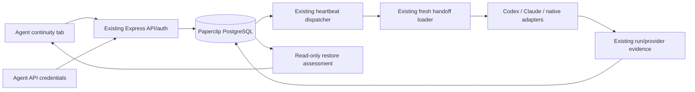

# Agent continuity layer

POC implementation on `codex/agent-continuity`. Local implementation/acceptance plan: [`doc/plans/2026-10-09-agent-continuity.md`](../doc/plans/2026-10-09-agent-continuity.md). This requested feature reference uses the already-existing `docs/` root; implementation planning remains in `doc/plans/`.

## Problem and boundaries

Employees should keep their identity and communicate even when a provider process or conversation changes. Paperclip already has durable task sessions, task-backed conversations, bounded history handoff, native checkpoint/resume, process ownership and restart reconciliation. This layer extends those mechanisms. It does not introduce another control plane.

Paperclip PostgreSQL remains authoritative for agents, messages, checkpoints, tasks, run evidence, budgets, approvals and audit. No OpenRig code is copied, no OpenRig dependency is installed, and no external license/NOTICE obligation is introduced by this implementation.

## Existing architecture verified from source

| Concern | Existing owner and evidence |
| --- | --- |
| Identity | `agents.id` UUID; display names/URL keys are separate. `services/agents.ts` resolves company-scoped references. |
| Session identity | `agent_task_sessions`: unique company + agent + adapter + task key. Provider ID/parameters are independent of the Agent UUID. `agent_runtime_state` retains compatibility state for unscoped runs. |
| Execution | `services/heartbeat.ts` dispatches and owns execution, results, cancellation, retry and persistence. It is more than a polling protocol. |
| Codex/Claude | Adapter execute functions bind saved sessions to cwd/config/provider identity, pass resume IDs, validate provider output and can fall back to fresh context. Process termination does not by itself delete provider continuation state. Live availability still needs provider evidence. |
| Work | Issues own assignment, checkout, status and task workflow. Task comments/mentions and persistent agent conversations may authorize wakes. |
| Workspace | Project/execution workspace records bind company/project/task to path, branch, provider and cleanup lifecycle. |
| Restart | Native runtime uses durable run/checkpoint evidence, leases, process identity and finalization/recovery reconciliation. A saved ID is not a restored provider. |
| Delivery | Existing `native-session-handoff.ts` builds bounded, redacted, task-scoped history. The new structured packet is delivered through its loader. |

Comments/conversations were evaluated for mailbox reuse. Both require a task and carry task/wake semantics. A small delivery table is needed for task-free messages; those existing flows are unchanged.

## Data model and compatibility

- `agents.seat_alias`: nullable. API normalizes lowercase ASCII `seat@team` aliases (max 120 characters); the database enforces uniqueness within a company. Null aliases remain valid. Terminated agents retain reserved aliases until cleared/deleted. UUID remains every task/session/history identity. Alias changes never reset sessions. Existing name-derived references still work.
- `agent_mailbox_messages`: UUID delivery ID, company, sender/recipient Agent UUIDs, thread UUID, optional related task, body, created/read timestamps. Broadcast creates one row per recipient sharing a thread. Sender/recipient company boundaries also have composite foreign keys.
- `agent_handoffs`: immutable application-level UUID checkpoint, company, agent, task, canonical JSON packet and creation time. PostgreSQL JSON is the source; Markdown is derived.
- `agent_task_sessions.handoff_id` and `continuity_policy` (default `resume`) attach an explicit decision to the existing session projection. No new session registry or lifecycle exists.
- Existing hard deletes preserve their semantics through cascade/set-null foreign keys. Normal session reset does not delete handoff history.
- Migration `0300_agent_continuity.sql` is additive and Drizzle-generated. The worktree already had uncommitted migrations 0295–0299. They were preserved. Continuity commits include only 0300; its committed snapshot was separately generated from the tracked schema plus continuity. The local snapshot/journal still include the user's earlier pending features. The same continuity SQL was verified in both generations. Number gaps are allowed by the existing migration numbering checker.

Direct DB writers must follow the normalized alias format; case normalization is the API contract. Existing APIs receive an optional additive alias field. New continuity routes use canonical Agent UUIDs; obtain that UUID through existing company-scoped Agent alias lookup first.

## Mailbox semantics

Messages represent information, questions, review feedback or status. They do not create tasks, change ownership, authorize execution, clear approvals or schedule a wake. Agents poll with existing credentials; automatic injection/tool discovery is not added.

- `POST /api/agents/:id/mailbox`: `{recipientIds, body, threadId?, relatedIssueId?}`. Maximum 25 distinct recipients, 8,000 body characters. Company/task validation precedes the transaction.
- `GET /api/agents/:id/mailbox?unread=true`: up to 100 newest unread deliveries.
- `GET .../mailbox?threadId=<uuid>`: up to 100 deliveries involving this agent. A recipient does not see other recipients' private replies/read receipts.
- `POST .../mailbox/:messageId/read`: only this recipient's delivery; repeated reads are idempotent.
- Reply sender/recipients must belong to the existing thread. Broadcast recipients are deduplicated.
- Send/read and audit records commit together. Audit contains IDs and relations, not message bodies. Operator-authored sends retain operator attribution in audit.

Agents can access only their own mailbox/continuity. Board reads use existing company access; writes require the existing `agents:create` management decision. Existing authentication and responsible-user company intersection checks remain in force.

## Handoff lifecycle

`POST /api/agents/:id/handoffs` accepts `{issueId, expectedSessionId, policy, content}`. The content requires goal, changed files, completed/in-progress work, acceptance criteria, tests/commands/results, decisions, unresolved items, blockers and next actions. Empty arrays explicitly represent no entries; goal, acceptance criteria and next actions cannot be empty. Content is capped at 12 KB and is secret-redacted before persistence.

The server records company/Agent/task identity, adapter, workspace/path/worktree/branch, previous provider identifier, creation time and source trust. The client cannot replace these authoritative values. Saved-session comparison rejects stale requests. Task ownership/status never comes from handoff content.

`GET /api/agents/:id/handoffs` returns up to 50 checkpoints with a human-readable Markdown view. Provider context uses the canonical JSON and explicitly labels it background data, not authorization or instructions.

| Policy | Effect |
| --- | --- |
| `checkpoint_only` | Save checkpoint; keep provider ID and current policy. Do not replace a handoff already reserved for fresh dispatch. Agents may use this during execution. |
| `resume` | Board-controlled explicit decision to keep the existing session. Does not start a provider. |
| `fresh_with_handoff` | Board-controlled explicit decision after execution settles. Validate handoff/workspace; preserve old parameters until the next dispatch succeeds. |

Policy changes lock the same company-scoped task row used by heartbeat claims and reject queued/running/scheduled-retry runs for the agent. Legacy task-identifier session keys are recognized; only an explicit idle policy change normalizes the selected row to the task UUID. Custom/unscoped keys are not silently rebound to a task.

On the next authorized heartbeat, a linked handoff and its saved local workspace/branch are revalidated before old/explicit resume IDs are ignored. Missing directories, branch changes, malformed packets and quarantined provenance fail closed. Native and legacy dispatch both receive fresh context through the existing loader. A successful run with new session evidence restores `resume`. Failed execution or missing fresh provider session preserves the pending handoff and previous parameters. Goal/checkpoint updates during execution cannot prematurely consume the policy. No context-size threshold or automatic rotation is implemented.

Quarantined agent output stays inspectable as a checkpoint but cannot enter a fresh provider context. Existing source-trust resolution is reused, including invalid-run fail-closed behavior. An operator must write a sanitized checkpoint; this POC adds no trust-promotion engine.

## Honest restart/restore

`GET /api/agents/:id/continuity` assesses up to 50 saved sessions without starting or stopping providers. It checks task association/ownership, adapter binding, handoff completeness/trust, local path/worktree and saved branch. Remote evidence is explicitly unresolved.

| Status | Meaning |
| --- | --- |
| `resumed` | Native provider acknowledged `session.resumed` during this controller boot; the same run/session has current controller process identity and an unexpired ownership lease. |
| `fresh` | No saved provider ID or handoff; execution has not begun. |
| `fresh_with_handoff` | Valid checkpoint is ready for a fresh session; execution has not necessarily begun. |
| `awaiting_decision` | Saved ID alone, completed task, or provider continuity without sufficient current proof. |
| `attention_required` | Invalid association/adapter, missing/changed local workspace/branch, incomplete/quarantined handoff, or unverifiable remote state. |
| `failed` | Last session execution failed; inspect run history before retrying. |

Old boot IDs and historical resume receipts cannot prove current resumption. Legacy Codex/Claude IDs remain uncertain in this read model until a provider-aware probe is available. Existing native restart reconciliation remains the owner of actual recovery. Mailbox/checkpoints survive process restart because they live in the Paperclip DB.

## OpenRig references and deliberate exclusions

Concepts consulted on 2026-10-09: stable seats, persistent communication, handover across fresh conversations, and honest restore checks. Primary references: [OpenRig repository](https://github.com/mvschwarz/openrig), [restore/reboot](https://openrig.dev/features/restore-reboot), [FAQ](https://openrig.dev/docs/faq). These are conceptual references; no OpenRig runtime is used.

Excluded: SQLite state, tmux, OpenRig queues/ownership, a second workflow/governance/budget/approval engine, autonomous CEO, multi-host runtime, Slack/Telegram additions, personalities, auto-org creation and UI redesign.

## Validation

The final reconciled commands/results are recorded in the implementation plan. The final targeted selection passed 254 tests; source-only Codex/Claude adapter projects passed 813 tests (2 skipped); UI passed 7,505 tests. Workspace type/build checks, migration checks and token gates passed. Local evidence includes real embedded PostgreSQL upgrade/API tests, fresh/failing heartbeat dispatch with a fixture adapter, native resume evidence fixtures, workspace/session regression tests, two separate process boots over the same durable DB, and Aside interaction with the actual new component/API on an isolated DB. These are not proof of live Codex/Claude account continuation or a deployed restart.

The existing root suite did **not** pass: its first server lane reported 160 failures across chat and AI connection suites and exited before subsequent lanes. Chat stacks show disk exhaustion; after own fixture cleanup, all 1,063 chat tests passed. AI stacks show existing parent project-auth configuration conflicts: 40 failures remained in the two-suite retry. A disposable-cwd diagnostic passed the same auth guard for both providers; the canonical-path suite retry still failed. No existing security guard or user configuration was changed. The plan records bounded diagnostics; a fully passing existing suite remains a validation gate.

## Known limitations and follow-up

- No production migration, operating-server restart, push or merge was performed.
- Legacy provider session existence/authentication is not actively probed; stored IDs yield uncertainty rather than a false `resumed`.
- Remote/multi-host workspace verification, automatic mailbox wake/injection, native mailbox tools, pagination beyond bounded pages and automatic rotation remain follow-up candidates.
- Session rotation needs a saved task-session row. A task with no prior run has ordinary fresh startup; orphan checkpoint history after a manual reset is inspectable but not automatically rebound.
- The browser check mounted the actual component with actual continuity routes and disposable PostgreSQL; full authenticated AgentDetail deployment was not exercised. A preview wrapper supplied operator identity and the existing agent lookup/update service.
- Existing full-suite regression gate remains unresolved; run all lanes in a clean isolated environment with enough disk space before production adoption. Focused passing retries do not replace that gate.
